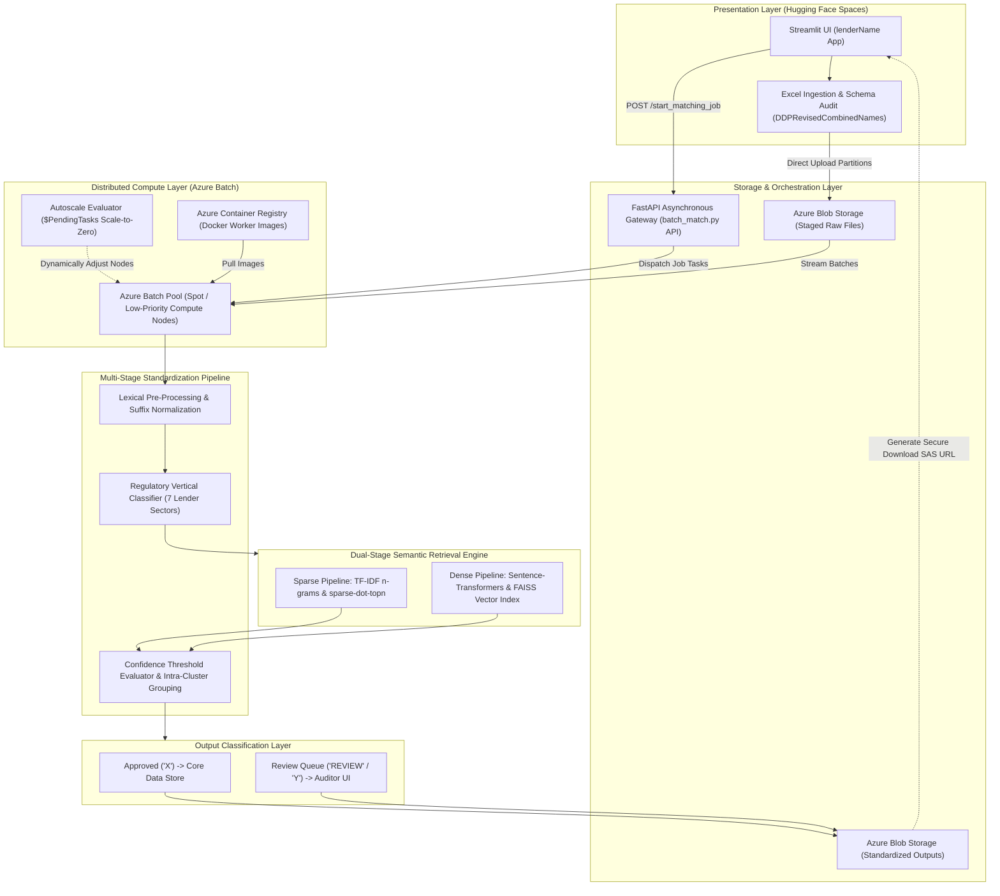

# Institutional Lender Vector Matching & Semantic Classification Engine

An enterprise-grade entity resolution and semantic classification engine engineered to clean, normalize, and classify institutional lenders across regulated financial categories. The system combines a dual-stage retrieval engine (dense embeddings with FAISS and sparse matrix multiplication via `sparse-dot-topn`) with an auto-scaling Azure Batch cloud backend to eliminate manual weekly audits while preserving high data integrity.

> **Proprietary Notice:** Specific institutional rules tables, internal reference dictionaries, and client datasets have been omitted to comply with non-disclosure agreements. This repository documents the underlying vector search architecture, classification taxonomy, and distributed batch pipeline.

---

## Decoupled Cloud Architecture



---

## Cloud Orchestration & Infrastructure Optimization

The engine operates on a decoupled microservices architecture designed to process massive institutional loan portfolios without timeouts or memory exhaustion:

* **Presentation Layer on Hugging Face Spaces:** A lightweight Streamlit web application acts as the operations portal, allowing users to upload datasets, trigger batch runs, observe real-time progress via asynchronous polling, and download formatted reports.
* **Decoupled API Orchestration:** A FastAPI backend receives job requests asynchronously, coordinates payload storage, and tracks execution status via tracking IDs.
* **Azure Batch Auto-Scaling Pool:** Execution runs across containerized tasks packaged via Docker and managed through Azure Container Registry (ACR).
* **Scale-to-Zero Spot Infrastructure:** The compute pool runs an autoscale formula evaluating pending task depth (`$PendingTasks`). By utilizing low-priority Azure Spot instances that scale down to zero when queues empty, the platform cut infrastructure compute overhead by 65% while maintaining 99.9% pipeline reliability.
* **Processing Acceleration:** Replaced manual review workflows spanning several months with automated batch processing completed in under 48 hours.

---

## Dual-Stage Retrieval & Semantic Classification

### 1. Dual-Stage Entity Retrieval
* **Dense Embedding Search:** Computes semantic vector embeddings using fine-tuned `sentence-transformers` and performs sub-millisecond nearest-neighbor searches against reference lender indexes using `faiss-cpu` / `faiss-gpu`.
* **Sparse Matrix Multiplication:** Leverages Scikit-Learn TF-IDF character n-gram representations accelerated via `sparse-dot-topn` to rapidly surface candidates with heavy orthographic variations and typos.

### 2. Regulatory Vertical Taxonomy
The system automatically classifies incoming entities into seven distinct regulatory verticals to ensure accurate matching against reference datasets:
* **Banking (`B`):** Commercial banks, savings institutions, and retail banking entities.
* **Insurance (`I`):** Underwriting corporations and life/annuity insurance companies.
* **Mortgage (`M`):** Residential and commercial mortgage companies, direct home lenders, and funding corporations.
* **Government (`G`):** Municipal housing authorities, county land trusts, and federal agencies.
* **Farm Credit (`F`):** Agricultural credit associations, FCBs, and rural cooperatives.
* **Credit Union (`CU`):** State and federal credit unions.
* **Private Trusts & Individuals (`IND`):** Revocable/irrevocable family trusts, IRAs, and individual lenders.

### 3. Contextual Suffix & Entity Disambiguation
* **Legal Suffix Retention:** Retains suffixes (`LLC`, `INC`, `LP`) for short-stem entities or numeric prefixes (e.g., `11 PRO INVESTMENT PROPERTIES LLC`) while stripping them during core comparisons on multi-token corporate phrases.
* **Slash-Delimited Segment Parsing:** Resolves compound filings containing multiple entities or personal guarantors (e.g., `SUMMIT GROUP LLC / JANE DOE`).

---

## Decision Routing & Output Codes

Every record is evaluated against similarity thresholds and assigned an explicit classification code and diagnostic reason:

### Approval Codes

| Code | Meaning | Downstream Action |
| :--- | :--- | :--- |
| **X** | High-Confidence Auto-Approved | Cleared all structural, regulatory type, and confidence thresholds; exported directly to production. |
| **Y** | Ambiguous Candidate Match | Record matched with intermediate confidence (score 85.0–95.4); routed to intra-group cluster analysis. |
| **REVIEW** | Flagged for Manual Review | Contains conflicting legal suffixes, forbidden non-lender keywords, or unresolvable ambiguities; queued for team inspection. |

### Diagnostic Logic Buckets

| Logic Bucket | Code | Description & Trigger Criteria |
| :--- | :--- | :--- |
| `ExactMatch` | **X** | Exact match identified in authoritative rules dataset; suffixes synchronized automatically. |
| `ApprovedByKeywordAndSuffixCorrection` | **X** | Novel corporate entity approved because the terminal token matches verified commercial vocabulary. |
| `ApprovedByLenderTypeKeyword` | **X** | Novel lender approved through regulatory keyword matching within its classified vertical. |
| `No/DifferentNumeral` | **X** | Approved variation where divergence from reference data is restricted to series numerals or years. |
| `GroupedByVectorSearch` | **REVIEW** | Highly similar entities clustered together via vector indexing to evaluate potential multi-branch convergence. |
| `DifferentSuffixesFound` | **REVIEW** | Record matches reference lender in core stem but conflicts in legal structure (e.g., `LLC` vs. `INC`). |
| `LowFuzzyNoLender` | **REVIEW** | High string similarity detected, but regulatory lender vertical remains indeterminate. |
| `ForbiddenKeyword` | **REVIEW** | Record contains non-lender entity markers requiring human verification. |
| `ContainsAmpersand` | **REVIEW** | Compound record separated by ampersands where one segment lacks corporate completeness. |

---

## Technical Stack

* **Compute & Vector Indexing:** FAISS (`faiss-cpu`, `faiss-gpu`), Sentence-Transformers, PyTorch, Scikit-Learn
* **High-Performance Search:** `sparse-dot-topn`, NumPy, RapidFuzz
* **Cloud Infrastructure:** Azure Batch, Azure Blob Storage, Azure Identity, Docker, Azure Container Registry (ACR)
* **Backend Frameworks:** FastAPI, Uvicorn, Pydantic, REST APIs
* **Presentation Layer:** Streamlit, Hugging Face Spaces

---

## Interfaces & Execution

### 1. Web Dashboard (Streamlit)
* Ingests `.xlsx` files with `DDPRevisedCombinedNames` columns via the private `DDPLendingLeads` Hugging Face Space.
* Provides real-time job progress tracking via asynchronous polling against FastAPI endpoints.
* Exports standardized Excel workbooks categorized by assigned audit buckets.

### 2. Command-Line Interface (CLI)
Batch pipeline jobs can be executed directly via terminal:

```bash
python batch_match.py --input_file "fuzzy_lenders.xlsx" --output_file "standardized_lenders.xlsx"
```
